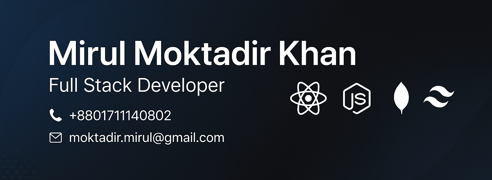

## About Me
### 👋 Hi there, I'm Mirul Moktadir Khan

I'm a passionate **Full Stack Web Developer** with a focus on building dynamic and responsive web applications using modern technologies. My core tech stack includes:

- 🧠 **Frontend:** React.js, Tailwind CSS, JavaScript  
- 🛠️ **Backend:** Express.js, Node.js  
- 💾 **Database:** MongoDB

I enjoy creating clean, efficient, and scalable applications, and I'm always eager to learn new tools and best practices to improve my workflow.

## 🔧 Projects
I've built several full-stack projects that showcase my skills in real-world development scenarios.  
➡️ Client Side: [Royal Bites Restaurant](https://github.com/moktadir-mirul/royal-bites-client) Server: [Royal Bites Server](https://github.com/moktadir-mirul/royal-bites-restaurant-server) 
➡️ Client Side: [Plant Companion](https://github.com/moktadir-mirul/plant-companion-client) Server: [Plant Companion Server](https://github.com/moktadir-mirul/plant-companion-server) 
➡️[Career Compass](https://github.com/moktadir-mirul/career-compass)

# 💻 Skills:
              

## 📫 Let's Connect!
I'm currently open to collaboration, freelance work, and full-time opportunities.  
Feel free to reach out or explore my work here!
  

# 📊 GitHub Stats:
 
 

---

Thanks for visiting! 🌟

